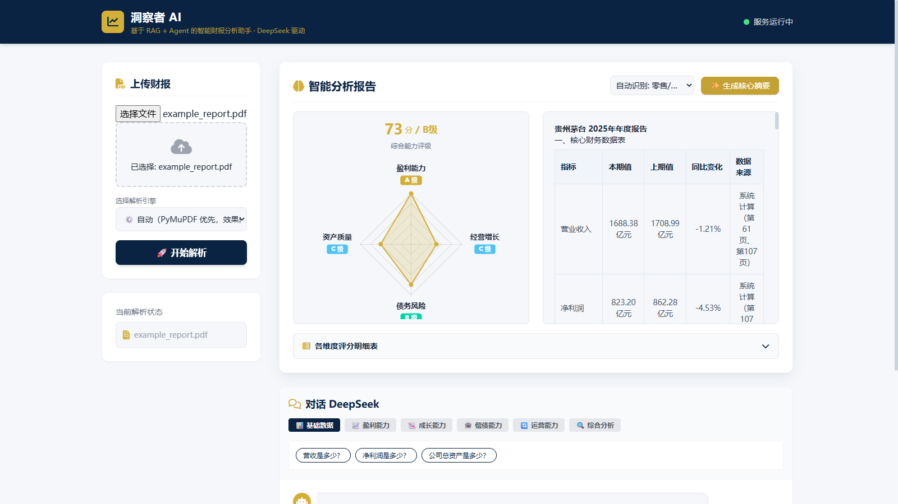

# Financial Report AI Assistant

<p align="right"><b>English</b> | <a href="README.md">中文</a></p>

<p align="center">
  
  
  
  
  
  
</p>

An LLM-powered assistant that helps non-finance people read listed-company PDF financial reports. Upload a report, then ask questions in natural language, compute metrics, generate a summary and view a capability radar chart.

---

## Preview

<p align="center">
  
</p>

> Real run: after uploading the **Kweichow Moutai 2025 Annual Report** (a 143-page PDF), the system produced an overall capability rating (73 / Grade B), a four-dimension capability radar chart (Profitability A / Growth C / Solvency T / Asset Quality C) and a core financial data table. Every figure in the table is annotated with its source page number, produced automatically by the RAG retrieval pipeline.

---

## Project Scale and Key Implementations

| Dimension | Implementation |
|---|---|
| Agent workflow | LangGraph closed loop: plan → tool call → reflect → retry, converging within at most **5 rounds** |
| Tool layer | **19** financial calculation tools wrapped as callable tools |
| Document parsing | Hybrid LlamaParse parsing, solving **borderless tables** in Chinese financial-report PDFs |
| Retrieval | BGE-M3 + FAISS semantic retrieval of key metrics (Top-K), combined with BM25 |
| Deployment | One-command Docker Compose startup, GPU / CPU dependency separation + health checks |

> ⚠️ Current status: the retrieval and tool-calling pipeline is fully working and passes integration tests, but a systematic retrieval-quality evaluation baseline has **not** yet been established. That is the next step. I do not think "the demo runs" is the same as "the output is under control".

---

## Agent Workflow

```
User question
   ↓
Task planning
   ↓
Tool calls (19 financial tools)
   ↓
Reflection ── if not converged, return to "Task planning" and retry, up to 5 rounds
   ↓
Generate analysis + citation traceability + capability radar chart
```

- **State management**: context is trimmed on demand to prevent bloat after multiple tool-calling rounds.
- **Failure handling**: LLM call failures are retried with a backoff strategy; when a tool raises, the system falls back to previously obtained results rather than filling the gap with hallucinated content.
- **Integration tests**: `tests/` contains `integration_test.py` / `integration_agent_test.py` / `integration_test_full.py`.

---

## Tech Stack

| Layer | Technology |
|---|---|
| Agent | LangGraph · LangChain · ReAct · Function Calling |
| Parsing and retrieval | LlamaParse · BGE-M3 · FAISS |
| Backend | Python async · FastAPI · Uvicorn |
| Frontend | HTML + Tailwind + ECharts |
| Deployment | Docker Compose, CUDA 12.6 |

---

## Core Features

- **Smart PDF parsing**: PyMuPDF + LlamaParse hybrid parsing with support for borderless tables. The parsing engine is selectable in the UI: `Auto` / `Force LlamaParse` / `PyMuPDF only (offline)`
- **RAG Q&A**: vector retrieval over FAISS + BGE-M3 for precise answers about financial data
- **AI Agent**: LangGraph ReAct loop that plans, calls tools, reflects and retries automatically
- **21 financial metrics**: growth rates, margins, ROE, EPS, PE, debt ratio, current ratio, quick ratio, asset/inventory turnover, dividend yield, trend analysis, year-over-year analysis, industry comparison and more (full list in `get_tools()` in `src/financial_report_ai_assistant/core/agent.py`)
- **Capability radar chart**: 4-dimension weighted scoring based on the SASAC enterprise performance standard (profitability 30% / asset quality 20% / solvency 20% / growth 30%), with 7 industry benchmark libraries and Altman Z-Score risk zones
- **One-click summary**: structured core summary of the financial report
- **Precise traceability**: every answer is annotated with its source page number, and the original page can be rendered with highlights

---

## Quick Start

```bash
# Docker (NVIDIA GPU required)
docker compose up --build

# Local development
poetry install
poetry run poe start
```

Open http://localhost:8000. On first use, put your `DEEPSEEK_API_KEY` in `.env`; without it the page loads but every AI request returns 401.

> Full step-by-step deployment instructions (prerequisites, API key setup, cache clearing, tests, `poe` tasks, API reference and environment variables) are in the Chinese README: [`README.md`](README.md).
