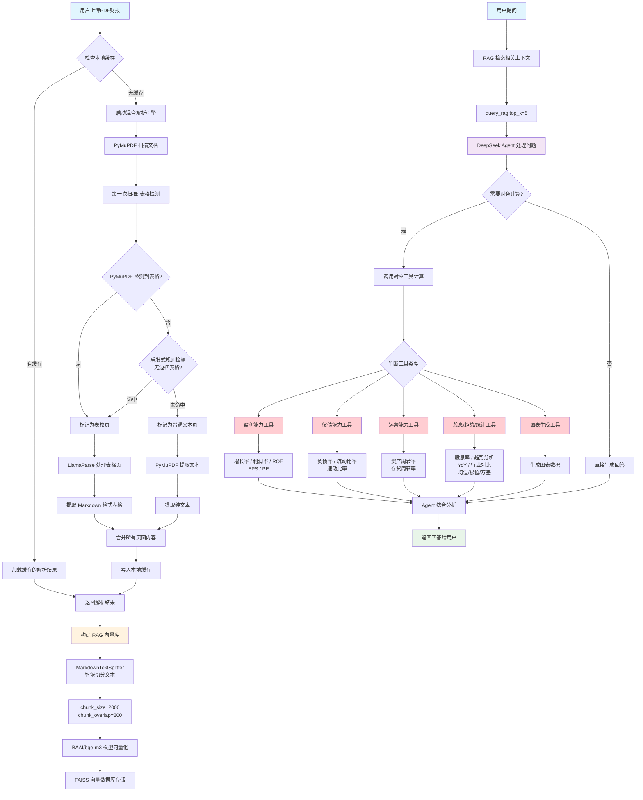

# 🤖 财报AI分析助手 (Financial Report AI Assistant)

<!-- 这一行是徽章(Badges)，它们是项目状态的可视化标志，非常专业。 -->
<p align="center">
  
  
  
  
  
</p>

> ⚠️ **项目状态：MVP (最小可行性产品) 已完成**
> 这是一个旨在学习和展示现代AI应用开发全流程的项目。

这是一个Web应用，旨在利用大语言模型（LLM）的能力，帮助非金融专业人士轻松读懂并分析上市公司的PDF格式财务报表。用户只需上传一份财报，即可通过自然语言进行提问、要求计算和生成通俗易懂的摘要。

---

## ✨ 核心功能

*   **📄 智能PDF解析**: 集成 **LlamaParse**，支持从复杂的中文财报PDF中提取文本和无边框表格。
*   **💬 核心指标问答**: 基于 **RAG (检索增强生成)** 技术，精准回答关于营收、净利润等具体数据的问题。
*   **🧠 真正的 AI Agent**: 基于 **LangGraph** 构建的自主推理 Agent，具备：
    *   📋 **任务规划**: 将复杂问题分解为多个子步骤
    *   ⚙️ **工具执行**: 自动调用计算器进行财务指标计算
    *   🔍 **自我反思**: 检查计算结果是否合理，异常时自动重试
    *   🔄 **ReAct 循环**: 支持多轮迭代推理（最多5轮）
*   **💰 财务计算工具**: 支持 19 种财务指标计算：
    *   盈利能力：增长率、利润率、ROE、EPS、PE
    *   偿债能力：资产负债率、流动比率、速动比率
    *   运营能力：资产周转率、存货周转率
    *   分析工具：股息率、趋势分析、同比分析、行业对比
    *   统计图表：均值、极值、方差、图表生成
*   **✍️ 一键生成摘要**: 针对长文档生成结构化的核心财务摘要，快速掌握企业经营状况。
*   **🐳 Docker一键部署**: 提供完整的 Docker Compose 配置，支持前后端一键启动，解决环境依赖问题。

---

## 🛠️ 技术栈与架构

本项目采用前后端分离的现代Web架构：

*   **前端**: **Streamlit** - 交互式数据分析界面。
*   **后端**: **FastAPI** - 高性能异步API服务。
*   **AI核心**:
    *   **LangGraph**: 构建具备 ReAct 循环的自主推理 Agent。
    *   **FAISS**: 本地向量数据库，用于知识库检索。
    *   **LlamaParse**: 专业的文档解析服务。
    *   **BGE-M3**: 中文语义 Embedding 模型。
*   **基础设施**:
    *   **Docker & Docker Compose**: 容器化部署。
    *   **Poetry**: 依赖管理。

---

## 🏗️ 系统架构



---

## 🔄 Agent 工作流程

当用户提出复杂问题时，Agent 会进行以下推理：

1. **规划 (Planner)**: 分析问题，分解为多个子任务
   - 例如："计算营收增长率" → [提取2023营收, 提取2022营收, 计算增长率]

2. **执行 (Executor)**: 根据计划调用对应工具
   - 调用 `tool_calculate_growth_rate(500亿, 400亿)`

3. **反思 (Reflection)**: 检查结果是否合理
   - 增长率 25%，合理 ✓
   - 数值异常？重新提取数据

4. **迭代**: 重复执行直到任务完成（最多5轮）

5. **生成回答**: 整合所有结果，生成最终回答

---

## 🚀 快速开始 (Docker 推荐)

这是最简单、最推荐的运行方式，无需在本地配置复杂的 Python 环境。

### 0. 克隆项目

```bash
git clone https://github.com/Jerry518520/financial-analysis-AI-assistant
cd financial-analysis-AI-assistant
```

### 1. 前置准备
*   安装 [Docker Desktop](https://www.docker.com/products/docker-desktop/) 并启动。
*   获取 API Key:
    *   **DeepSeek API Key**: 用于大模型对话（可在 [DeepSeek](https://platform.deepseek.com/) 申请）。
    *   **LlamaCloud API Key**: 用于 PDF 解析 (可在 [LlamaCloud](https://cloud.llamaindex.ai/) 免费申请)。

### 2. 配置环境变量

复制环境变量模板：

```bash
cp env.template .env
```

然后编辑 `.env` 文件，填入你的 API Key：

```env
DEEPSEEK_API_KEY=sk-xxxxxxxxxxxxxxxxxxxxxxxx
LLAMA_CLOUD_API_KEY=llx-xxxxxxxxxxxxxxxxxxxxxxxx
```

### 3. 一键启动
在项目根目录打开终端，运行：

```bash
docker-compose up --build
```

### 4. 访问应用
*   **前端界面**: 打开浏览器访问 [http://localhost:8501](http://localhost:8501)
*   **后端文档**: [http://localhost:8000/docs](http://localhost:8000/docs)

### 5. 停止应用

```bash
# 按 Ctrl + C 停止

# 或者完全清理容器
docker-compose down
```

---

## 🖥️ 前置软件要求

| 软件 | 说明 | 下载地址 |
|------|------|----------|
| Docker Desktop | 容器运行环境（必须） | [点击下载](https://www.docker.com/products/docker-desktop) |
| Git | 版本控制工具（可选，用于克隆项目） | [点击下载](https://git-scm.com) |

> 💡 **没有 Git 怎么办？** 可以直接点击 GitHub 页面上的绿色 "Code" 按钮，选择 "Download ZIP"，解压后进入目录即可。

---

## ❓ 常见问题

**Q: 第一次启动很慢怎么办？**

A: 首次运行需要下载 Docker 镜像并安装依赖，大约需要 3-5 分钟。后续启动会很快。

**Q: Windows 用户 `cp` 命令不能用？**

A: 使用 PowerShell：
```powershell
copy .env.example .env
```
或者直接复制文件并重命名为 `.env`。

**Q: 启动失败怎么办？**

A: 检查以下几点：
1. Docker Desktop 是否已启动（任务栏图标是否显示）
2. `.env` 文件是否已创建且 API Key 是否正确
3. API Key 是否还有额度

**Q: 如何更新到最新版本？**

```bash
git pull
docker-compose up --build
```

---

## 🐍 本地开发运行 (可选)

如果你想进行代码开发，可以使用 Poetry 在本地运行。

1.  **安装依赖**:
    ```bash
    poetry install
    ```
2.  **启动后端**:
    ```bash
    poetry run uvicorn financial_report_ai_assistant.api.main:app --reload
    ```
3.  **启动前端**:
    ```bash
    poetry run streamlit run frontend/main.py
    ```

---

## 📝 验收清单

- [x] 上传 PDF 文件并解析成功
- [x] 提问"今年的营收是多少"，能准确检索并回答
- [x] 提问"计算净利润增长率"，能调用计算器工具
- [x] 点击"生成摘要"，能输出完整的财报分析
- [x] Agent 能自动规划复杂问题的解决步骤
- [x] Agent 能进行多轮 ReAct 循环推理
- [x] Agent 能反思检查计算结果是否合理
- [x] 支持 19 种财务指标计算工具
